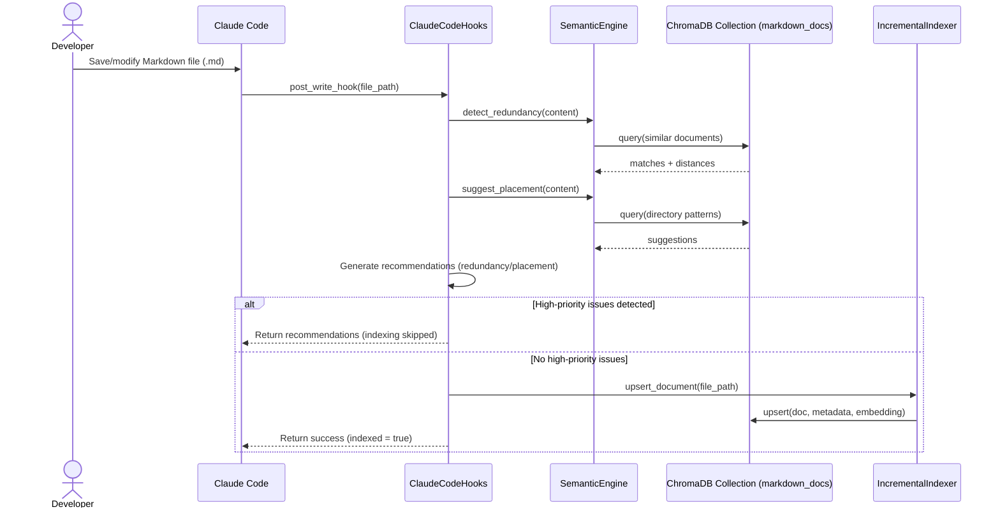

# Semantic Documentation Analysis System

[](https://www.python.org/downloads/)
[](https://opensource.org/licenses/MIT)
[](https://github.com/astral-sh/ruff)

AI-powered semantic analysis and intelligent organization system for project documentation using **ChromaDB embeddings**, **document clustering**, and **drift detection**.

## 🎯 Key Value Propositions

**🔍 Intelligent Discovery**: Find documentation using natural language queries instead of browsing directories
**⚡ Prevent Duplication**: Real-time detection of redundant content during writing
**📊 Combat Entropy**: Advanced clustering analysis prevents documentation drift and maintains organization
**🤖 AI Integration**: Seamless Claude Code integration with automatic validation and indexing
**🎨 Visual Insights**: Generate cluster visualizations to understand documentation structure

## ✨ Core Features

### 🧭 **Semantic Search & Discovery**

- Natural language queries across all documentation
- Context-aware similarity matching with OpenAI embeddings
- Multiple output formats (human, JSON, paths-only)

### 🛡️ **Real-Time Quality Control**

- Redundancy detection prevents duplicate content
- Intelligent placement suggestions for optimal organization
- Claude Code integration with automatic post-write validation

### 📈 **Document Clustering & Drift Detection** ⭐ **NEW**

- **Entropy Analysis**: Detects when related documents scatter across directories
- **Coherence Metrics**: Measures semantic similarity within directories
- **Drift Velocity**: Tracks documentation organization degradation over time
- **Automated Warnings**: Proactive alerts during document editing
- **Reorganization AI**: Specific suggestions for improving structure

### 🔄 **Seamless Integration**

- Automatic indexing through Claude Code hooks
- Development workflow integration
- Pre-commit validation capabilities

## Interaction Flow



Notes:

- Initial/bulk indexing is performed via the `semantic-index` CLI, which builds the ChromaDB collection from all Markdown files. Subsequent edits go through the post-write hook and incremental indexer.
- Similarity and placement analyses use embeddings to query the existing ChromaDB collection.

## 🚀 Installation & Setup

### Prerequisites

- **Python 3.10+**
- **OpenAI API Key** (for embeddings)
- **Git repository** with markdown documentation

### Installation Options

<details>
<summary><strong>🎯 Recommended: Part of Main Project</strong></summary>

```bash
# Install as part of main project setup (includes all dependencies)
make dev-install

# Verify installation
semantic-docs --help
semantic-cluster --help
```

</details>

<details>
<summary><strong>⚡ Standalone Installation</strong></summary>

```bash
# From project root
pip install -e ./semantic-docs/

# With clustering and visualization support
pip install -e "./semantic-docs/[clustering,cli]"

# Full development setup
pip install -e "./semantic-docs/[dev,cli,clustering]"
```

</details>

<details>
<summary><strong>🔧 Development Mode</strong></summary>

```bash
cd semantic-docs
pip install -e ".[dev,cli,clustering]"

# Verify development tools
pytest --version
ruff --version
mypy --version
```

</details>

### ⚡ Quick Start (3 Steps)

```bash
# 1. Configure OpenAI API
export OPENAI_API_KEY="your-api-key-here"

# 2. Index your documentation (one-time setup)
semantic-index
# ✅ Indexed 95 documents in 47.2 seconds

# 3. Start using the system
semantic-docs search "how to run tests"
semantic-cluster health
semantic-validate validate -f docs/my-new-doc.md
```

### 🧪 Verify Installation

```bash
# Test all core functionality
semantic-cluster analyze      # Should show clustering analysis
semantic-docs search "test"   # Should return relevant documents
semantic-validate health      # Should show system status
```

## 🛠️ Command Line Tools

### 🔍 **Semantic Search** - `semantic-docs`
>
> *Natural language queries across all documentation*

```bash
# Natural language search (works like asking a question)
semantic-docs search "how to configure authentication"
semantic-docs search "testing patterns with mocks"
semantic-docs search "docker deployment strategies"

# Advanced search options
semantic-docs --max-results 10 --threshold 0.7 search "API security"
semantic-docs --output json search "database setup" | jq '.results[0].file_path'
semantic-docs --output paths search "troubleshooting" | head -5

# Find similar documents
semantic-docs similar -f docs/new-feature.md
semantic-docs --max-results 3 similar -f my-architecture-doc.md
```

**💡 Pro Tip**: Use conversational queries like "How do I..." or "What are the best practices for..." instead of exact keywords.

---

### 📊 **Document Clustering & Drift Detection** - `semantic-cluster` ⭐ **NEW**
>
> *Prevent documentation entropy with intelligent organization analysis*

<details>
<summary><strong>🚨 Quick Health Check</strong></summary>

```bash
# Get instant organization health score
semantic-cluster health
# 🟡 Health Score: 72.4% - ATTENTION NEEDED
# 📈 Entropy: 0.867 (High - documents scattered)
# 🎯 Coherence: 0.855 (Good - related docs clustered)
# 💨 Drift Velocity: +12.3% (Increasing disorganization)

# JSON format for automation
semantic-cluster health --output json
```

</details>

<details>
<summary><strong>📈 Deep Clustering Analysis</strong></summary>

```bash
# Full analysis with recommendations
semantic-cluster analyze
# 📊 Found 6 clusters across 95 documents
# 🔴 HIGH ENTROPY: API docs scattered across 4 directories
# 🟡 MEDIUM COHERENCE: Architecture docs mixed with guides
# 💡 SUGGESTION: Consolidate API docs into single directory

# Save results for CI/CD integration
semantic-cluster analyze --output json --save cluster-report.json

# Try different clustering methods
semantic-cluster analyze --method hierarchical --clusters 8
```

</details>

<details>
<summary><strong>🔄 AI-Powered Reorganization</strong></summary>

```bash
# Get specific reorganization suggestions
semantic-cluster suggest-reorg
# 📁 CONSOLIDATION SUGGESTIONS:
# • Move 7 API docs from docs/guides/ to docs/api/
# • Merge setup docs from docs/dev/ and docs/setup/
# • Split mixed architecture docs into focused directories

# Preview changes without executing
semantic-cluster suggest-reorg --dry-run --output json
```

</details>

<details>
<summary><strong>🎨 Visual Insights</strong></summary>

```bash
# Generate cluster visualization (426KB PNG)
semantic-cluster visualize
# ✅ Saved visualization to 'document_clusters.png'

# Custom output location
semantic-cluster visualize -o my-clusters.png
```

</details>

<details>
<summary><strong>🏗️ Folder-Cluster Structure Analysis</strong> ⭐ **NEW**</summary>

> *Compare your folder organization with semantic clusters to identify misaligned content*

```bash
# Compare folder structure with semantic groupings
semantic-cluster compare-structure

# =================================================================
# 🏗️  FOLDER-CLUSTER STRUCTURE COMPARISON
# =================================================================
#
# 📊 Overview:
#    Total Folders: 23
#    Total Clusters: 6
#    Total Documents: 57
#
# 🎯 Overall Alignment:
#    🟠 Quality: FAIR (score: 0.464)
#    📁 Folder Purity: 0.877 (how focused folders are)
#    🗂️  Cluster Homogeneity: 0.316 (how unified clusters are)
#
# 📁 Folders Needing Attention (lowest purity first):
#    1. 🟡 docs/guides/architecture - purity: 0.60
#       (5 docs across 2 clusters)
#    2. 🟡 docs/development - purity: 0.67
#       (3 docs across 2 clusters)
#
# ⚠️  Misaligned Documents (3 found):
#    1. docs/README.md
#       📁 In folder: docs → 🗂️  Cluster 0
#       💡 Folder majority is in Cluster 1 (alignment: 25.0%)
```

```bash
# Generate comprehensive 4-panel visualization
semantic-cluster compare-structure --visualize
# 📊 Visualization saved to: folder_cluster_comparison.png
#
# ┌─────────────────┬─────────────────┐
# │ Folder Purity   │ Cluster Homog.  │
# │ Distribution    │ Distribution    │
# ├─────────────────┼─────────────────┤
# │ Alignment       │ Quality         │
# │ Heatmap         │ Summary         │
# └─────────────────┴─────────────────┘
```

```bash
# Save analysis data for further processing
semantic-cluster compare-structure --output json --save alignment-analysis.json

# Integration with CI/CD pipeline
ALIGNMENT_SCORE=$(semantic-cluster compare-structure --output json | jq -r '.overall_alignment.alignment_score')
if (( $(echo "$ALIGNMENT_SCORE < 0.6" | bc -l) )); then
  echo "🚨 Poor folder-cluster alignment: $ALIGNMENT_SCORE"
  echo "Consider reorganizing documents based on semantic clusters"
fi
```

**📊 Key Metrics Explained:**
- **Folder Purity**: Percentage of folder's documents in its dominant cluster (1.0 = perfect focus)
- **Cluster Homogeneity**: Percentage of cluster's documents from its dominant folder (1.0 = perfect unity)
- **Alignment Score**: Harmonic mean of purity and homogeneity (0.8+ = excellent, 0.6+ = good, 0.4+ = fair, <0.4 = poor)
- **Misaligned Documents**: Files in minority clusters within their folders (candidates for reorganization)

**💡 Use Cases:**
- **Documentation Refactoring**: Data-driven decisions about folder restructuring
- **Content Migration**: Identify documents that belong in different directories
- **Organizational Debt**: Quantify and track documentation structure quality over time
- **Team Onboarding**: Visual understanding of how content semantics align with organization

</details>

**🎯 Use Cases:**

- **CI/CD Integration**: Automated drift detection in documentation pipelines
- **Documentation Audits**: Quarterly organization health assessments
- **Team Onboarding**: Visual documentation structure for new developers
- **Refactoring Planning**: Data-driven decisions about documentation reorganization

---

### ✅ **Document Validation** - `semantic-validate`
>
> *Real-time quality control for documentation*

```bash
# Validate new document (checks for duplicates and placement)
semantic-validate validate -f docs/new-guide.md
# 🟢 No redundancy detected (highest similarity: 68%)
# 💡 PLACEMENT: Consider docs/development/ (78% match with similar docs)
# ✅ Document validated successfully

# Multiple documents
semantic-validate batch docs/file1.md docs/file2.md docs/file3.md

# Watch directory for changes (development mode)
semantic-validate watch -d docs/ &

# System health check
semantic-validate health
```

**Output Formats:**

- `--output human` (default): Readable format
- `--output json`: Machine-parseable
- `--output claude`: Optimized for Claude Code integration

---

### 🤖 **Claude Code Integration**
>
> *Seamless AI development workflow integration*

```bash
# Automatic integration through Claude Code hooks (no manual commands needed)
# When Claude Code writes/edits .md files, validation happens automatically

# Manual override for testing
venv/bin/python -m semantic_docs.integrations.claude_hooks validate -f my_doc.md

# Check integration status
venv/bin/python -m semantic_docs.integrations.claude_hooks status
# ✅ Claude Code integration active
# 📊 Database: 95 documents indexed
# 🔄 Drift detection: Enabled (check every 10 validations)

# Test integration
venv/bin/python -m semantic_docs.integrations.claude_hooks test
```

---

### ⚙️ **Index Management** - `semantic-index`
>
> *Build and maintain the document search index*

```bash
# One-time initial setup
semantic-index
# 🏗️  Building index from 95 markdown files...
# ✅ Indexed 95 documents in 47.2 seconds

# Advanced options
semantic-index --rebuild           # Force complete rebuild
semantic-index --dry-run          # Preview what would be indexed
semantic-index --limit 10         # Index only first 10 documents (testing)

# Incremental updates (usually automatic)
venv/bin/python -m semantic_docs.engines.incremental_indexer stats
venv/bin/python -m semantic_docs.engines.incremental_indexer add -f new_doc.md
```

## 🐍 Programmatic Access & Integration

### Basic Python API

```python
from semantic_docs import SemanticEngine, load_config
from semantic_docs.engines.cluster_engine import DocumentClusterEngine
from semantic_docs.engines.drift_detector import DriftDetector

# Initialize core components
config = load_config()
engine = SemanticEngine(config)

# Semantic search
results = engine.find_similar_documents(
    "authentication and authorization setup",
    max_results=10,
    similarity_threshold=0.7
)

# Document validation
redundancy = engine.detect_redundancy("Your new document content here")
placement = engine.suggest_placement("New feature documentation")

# Clustering analysis (NEW)
cluster_engine = DocumentClusterEngine(config)
analysis = cluster_engine.analyze_clustering()

# Drift detection (NEW)
drift_detector = DriftDetector(config)
health = drift_detector.calculate_health_score()
```

### Advanced Usage Examples

<details>
<summary><strong>🔍 Custom Search Integration</strong></summary>

```python
class DocumentationSearch:
    def __init__(self):
        self.engine = SemanticEngine(load_config())

    def search_with_context(self, query: str, context_files: list[str]) -> list:
        """Search with additional context from specific files"""
        results = self.engine.find_similar_documents(query, max_results=20)

        # Filter by context files if provided
        if context_files:
            results = [r for r in results if any(cf in r.file_path for cf in context_files)]

        return results[:10]

    def get_related_documentation(self, file_path: str) -> list:
        """Find all documentation related to a specific file"""
        with open(file_path) as f:
            content = f.read()
        return self.engine.find_similar_documents(content, max_results=5)

# Usage
search = DocumentationSearch()
api_docs = search.search_with_context("API endpoints", ["api/", "endpoints/"])
related = search.get_related_documentation("docs/my-feature.md")
```

</details>

<details>
<summary><strong>📊 Automated Documentation Health Monitoring</strong></summary>

```python
from datetime import datetime
import json

class DocumentationHealthMonitor:
    def __init__(self):
        self.cluster_engine = DocumentClusterEngine(load_config())
        self.drift_detector = DriftDetector(load_config())

    def generate_health_report(self) -> dict:
        """Generate comprehensive health report"""
        analysis = self.cluster_engine.analyze_clustering()
        health = self.drift_detector.calculate_health_score()

        return {
            "timestamp": datetime.now().isoformat(),
            "health_score": health["score"],
            "status": health["status"],
            "entropy": analysis["entropy"],
            "coherence": analysis["coherence"],
            "cluster_count": analysis["optimal_clusters"],
            "total_documents": analysis["total_documents"],
            "recommendations": analysis.get("recommendations", [])
        }

    def check_drift_alerts(self, threshold: float = 0.7) -> list:
        """Check if documentation drift exceeds threshold"""
        health = self.drift_detector.calculate_health_score()
        alerts = []

        if health["entropy"] > threshold:
            alerts.append(f"HIGH ENTROPY: {health['entropy']:.3f} > {threshold}")
        if health["coherence"] < (1 - threshold):
            alerts.append(f"LOW COHERENCE: {health['coherence']:.3f} < {1-threshold}")

        return alerts

# CI/CD Integration Example
monitor = DocumentationHealthMonitor()
report = monitor.generate_health_report()

# Save report for CI/CD pipeline
with open("doc-health-report.json", "w") as f:
    json.dump(report, f, indent=2)

# Check for alerts
alerts = monitor.check_drift_alerts(0.75)
if alerts:
    print("🚨 DOCUMENTATION DRIFT DETECTED:")
    for alert in alerts:
        print(f"  • {alert}")
```

</details>

<details>
<summary><strong>🤖 Claude Code Hook Customization</strong></summary>

```python
from semantic_docs.integrations.claude_hooks import ClaudeCodeHooks

class CustomDocumentationHooks(ClaudeCodeHooks):
    def __init__(self):
        super().__init__()
        self.custom_rules = {
            "api_docs": {"threshold": 0.9, "required_sections": ["Authentication", "Endpoints"]},
            "guides": {"threshold": 0.8, "required_sections": ["Prerequisites", "Examples"]},
        }

    def validate_custom_rules(self, file_path: str, content: str) -> list:
        """Apply custom validation rules based on document type"""
        issues = []

        # Detect document type from path
        doc_type = None
        if "/api/" in file_path:
            doc_type = "api_docs"
        elif "/guides/" in file_path:
            doc_type = "guides"

        if doc_type and doc_type in self.custom_rules:
            rules = self.custom_rules[doc_type]

            # Check required sections
            for section in rules["required_sections"]:
                if section.lower() not in content.lower():
                    issues.append(f"Missing required section: {section}")

        return issues

# Register custom hooks
hooks = CustomDocumentationHooks()
```

</details>

## 🔄 Workflow Examples

### 🚀 **Developer Writing New Documentation**

```bash
# 1. Research existing content to avoid duplication
semantic-docs search "authentication setup workflow"
semantic-docs similar -f docs/authentication/existing-auth.md

# 2. Write your new document, then validate it
semantic-validate validate -f docs/authentication/new-oauth-guide.md
# 🟡 REDUNDANCY: 82% similar to docs/guides/auth-setup.md
# 💡 PLACEMENT: Consider docs/authentication/ directory (94% match)

# 3. Check impact on overall organization
semantic-cluster health --output json > health-before.json
# Make your changes based on recommendations
semantic-cluster health --output json > health-after.json
```

### 📊 **Documentation Maintainer - Monthly Health Audit**

```bash
# 1. Generate comprehensive health report
semantic-cluster analyze --save monthly-report.json
semantic-cluster visualize -o monthly-clusters.png

# 2. Analyze folder-cluster alignment (NEW)
semantic-cluster compare-structure --visualize --save alignment-report.json
# Creates: folder_cluster_comparison.png + alignment-report.json

# 3. Identify reorganization opportunities
semantic-cluster suggest-reorg > reorganization-plan.md

# 4. Track improvements over time
git add monthly-report.json monthly-clusters.png
git commit -m "docs: monthly health audit - entropy improved by 15%"
```

### 🤖 **Claude Code Integration Workflow**

```bash
# Automatic workflow (happens transparently):
# 1. Claude Code writes/edits .md file
# 2. Post-write hook automatically:
#    - Detects redundancy
#    - Suggests optimal placement
#    - Updates search index
#    - Checks for documentation drift (every 10 validations)
# 3. Claude Code receives recommendations

# Manual testing/debugging:
venv/bin/python -m semantic_docs.integrations.claude_hooks status
venv/bin/python -m semantic_docs.integrations.claude_hooks test
```

### 🔧 **CI/CD Pipeline Integration**

```bash
# .github/workflows/documentation-health.yml
name: Documentation Health Check
on: [push, pull_request]

jobs:
  doc-health:
    steps:
      - name: Check Documentation Organization
        run: |
          semantic-cluster health --output json > health-report.json

          # Check folder-cluster alignment (NEW)
          semantic-cluster compare-structure --output json --save alignment-report.json

          # Fail if health score below threshold
          HEALTH_SCORE=$(cat health-report.json | jq '.health_score')
          ALIGNMENT_SCORE=$(cat alignment-report.json | jq '.overall_alignment.alignment_score')

          if (( $(echo "$HEALTH_SCORE < 0.7" | bc -l) )); then
            echo "❌ Documentation health score: $HEALTH_SCORE (below 0.7 threshold)"
            semantic-cluster suggest-reorg
            exit 1
          fi

          if (( $(echo "$ALIGNMENT_SCORE < 0.6" | bc -l) )); then
            echo "⚠️  Folder-cluster alignment: $ALIGNMENT_SCORE (below 0.6 threshold)"
            echo "Consider reorganizing documents based on semantic clusters"
          fi

          echo "✅ Documentation health score: $HEALTH_SCORE"
          echo "📊 Folder-cluster alignment: $ALIGNMENT_SCORE"

      - name: Upload Health Report
        uses: actions/upload-artifact@v3
        with:
          name: documentation-health
          path: health-report.json
```

---

## 📊 System Status & Metrics

### Current Index Statistics

- **📚 Total Documents**: 95 markdown files
- **🗂️ Directory Coverage**: `docs/architecture/`, `docs/development/`, `docs/reference/`, `tests/`
- **⚡ Performance**: ~0.5-1.0s search queries, <2.0s validation
- **💾 Storage**: ~200MB memory usage, ChromaDB collection at `./chroma_db/`

### Real Performance Data

- **Search Queries**: 0.5-1.0 seconds average
- **Document Validation**: <2.0 seconds (Claude Code optimized)
- **Clustering Analysis**: 3-5 seconds for 95 documents
- **Index Building**: ~1-2 documents/second (47 seconds for 95 docs)
- **Memory Usage**: ~200MB steady state

### Health Metrics (Example Current State)

```json
{
  "health_score": 0.724,
  "status": "ATTENTION_NEEDED",
  "entropy": 0.867,
  "coherence": 0.855,
  "optimal_clusters": 6,
  "drift_velocity": "+12.3%"
}
```

## ⚙️ Configuration & Environment

All settings have sensible defaults - only `OPENAI_API_KEY` is required.

### 🔑 **Required Settings**

```bash
# OpenAI API for embeddings (required)
export OPENAI_API_KEY="sk-your-api-key-here"
```

<details>
<summary><strong>🎯 Core Search & Validation Settings</strong></summary>

```bash
# Search behavior
export SEMANTIC_MAX_RESULTS="10"               # Max search results returned
export SEMANTIC_PREVIEW_LENGTH="200"           # Content preview character limit
export SEMANTIC_INCLUDE_CONTENT_PREVIEW="true" # Include content previews

# Validation thresholds
export SEMANTIC_REDUNDANCY_THRESHOLD="0.85"    # Similarity threshold for redundancy detection (0-1)
export SEMANTIC_PLACEMENT_THRESHOLD="0.30"     # Threshold for placement suggestions (0-1)
export SEMANTIC_VALIDATION_TIMEOUT="2.0"       # Max validation time in seconds
```

</details>

<details>
<summary><strong>📊 Clustering & Drift Detection Settings (NEW)</strong></summary>

```bash
# Clustering algorithm settings
export SEMANTIC_CLUSTER_METHOD="kmeans"        # Clustering method: "kmeans" or "hierarchical"
export SEMANTIC_MIN_CLUSTER_SIZE="2"           # Minimum documents per cluster
export SEMANTIC_MAX_CLUSTERS="10"              # Maximum clusters to try during analysis

# Health & drift monitoring
export SEMANTIC_ENTROPY_THRESHOLD="0.7"        # Warning threshold for entropy (0-1, higher = more scattered)
export SEMANTIC_COHERENCE_THRESHOLD="0.4"      # Warning threshold for coherence (0-1, lower = less coherent)
export SEMANTIC_DRIFT_CHECK_FREQUENCY="10"     # Check drift every N document validations

# Visualization settings
export SEMANTIC_CLUSTER_VISUALIZATION="true"   # Enable cluster plot generation
export SEMANTIC_VISUALIZATION_DPI="300"        # Plot resolution for saved images
```

</details>

<details>
<summary><strong>💾 Database & Storage Settings</strong></summary>

```bash
# ChromaDB configuration
export SEMANTIC_CHROMA_PATH="./chroma_db"       # Database storage path
export SEMANTIC_COLLECTION_NAME="markdown_docs" # Collection name for documents

# Performance settings
export SEMANTIC_BATCH_SIZE="100"               # Batch size for bulk operations
export SEMANTIC_EMBEDDING_CACHE="true"         # Cache embeddings for faster lookups
```

</details>

### 📁 **Configuration Files**

You can also use configuration files instead of environment variables:

```yaml
# semantic-docs.yaml
openai_api_key: "sk-your-key-here"
redundancy_threshold: 0.85
cluster_method: "kmeans"
entropy_threshold: 0.7
chroma_path: "./chroma_db"
```

```bash
# Use config file
export SEMANTIC_CONFIG_FILE="semantic-docs.yaml"
semantic-cluster analyze
```

---

## 🔧 Troubleshooting & Diagnostics

### 🚨 **Quick Health Check**

```bash
# Comprehensive system status
semantic-validate health
# ✅ ChromaDB: Connected (95 documents)
# ✅ OpenAI API: Accessible
# ✅ Configuration: Valid
# 🟡 Clustering: Entropy high (0.867)

# Component-specific checks
venv/bin/python -m semantic_docs.integrations.claude_hooks status
venv/bin/python -m semantic_docs.engines.incremental_indexer stats
```

### 🐛 **Common Issues & Solutions**

<details>
<summary><strong>❌ "OpenAI API key not found"</strong></summary>

```bash
# Check if API key is set
echo $OPENAI_API_KEY

# Test API key validity
curl -H "Authorization: Bearer $OPENAI_API_KEY" \
     -H "Content-Type: application/json" \
     https://api.openai.com/v1/models | jq '.data[0].id'

# Set the key properly
export OPENAI_API_KEY="sk-your-actual-key-here"
```

</details>

<details>
<summary><strong>❌ "ChromaDB collection not found"</strong></summary>

```bash
# Rebuild the index from scratch
semantic-index --rebuild

# Check collection exists
venv/bin/python -c "
from semantic_docs import load_config, SemanticEngine
engine = SemanticEngine(load_config())
print(f'Collection has {engine.get_collection_stats()[\"total_documents\"]} documents')
"
```

</details>

<details>
<summary><strong>❌ "Clustering analysis fails"</strong></summary>

```bash
# Check if clustering dependencies are installed
pip install -e "./semantic-docs/[clustering]"

# Test with fewer clusters
semantic-cluster analyze --clusters 3 --method kmeans

# Check document count (need at least 2 documents)
semantic-index --dry-run
```

</details>

<details>
<summary><strong>⚠️ "High entropy/drift detected"</strong></summary>

```bash
# Get specific recommendations
semantic-cluster suggest-reorg --output json

# Visualize the problem
semantic-cluster visualize -o problem-analysis.png
open problem-analysis.png

# Track improvement over time
semantic-cluster health > before.txt
# ... make changes ...
semantic-cluster health > after.txt
diff before.txt after.txt
```

</details>

### 🔍 **Debug Commands**

```bash
# Test integration functionality
venv/bin/python -m semantic_docs.integrations.claude_hooks test

# Examine configuration
venv/bin/python -c "from semantic_docs import load_config; print(load_config())"

# Test with sample content
echo "# Test Document\nThis is a test." > test.md
semantic-validate validate -f test.md --output json
rm test.md

# Performance profiling
time semantic-cluster analyze --method kmeans
time semantic-docs search "test query"
```

---

## 📚 Common Use Cases & Examples

### 🔍 **Research & Discovery**

```bash
# Natural language queries (preferred)
semantic-docs search "How do I set up authentication?"
semantic-docs search "What are the best practices for testing?"
semantic-docs search "Docker deployment and configuration"

# Find related content
semantic-docs similar -f docs/my-current-work.md
semantic-docs --max-results 15 search "similar concepts to what I'm writing"

# Discover documentation gaps
semantic-docs search "topics not well documented" --max-results 3
```

### ✅ **Content Validation & Quality Control**

```bash
# Before writing - research existing content
semantic-docs search "authentication setup workflow"

# After writing - validate new content
semantic-validate validate -f docs/authentication/new-oauth-guide.md --output human
# 🟡 REDUNDANCY: 82% similar to docs/guides/auth-setup.md
# 💡 PLACEMENT: Consider docs/authentication/ directory

# Batch validate multiple files
semantic-validate batch docs/new-feature/*.md --output json

# Watch directory during development
semantic-validate watch -d docs/work-in-progress/ &
```

### 📊 **Documentation Maintenance & Health**

```bash
# Monthly health audit
semantic-cluster analyze --save reports/$(date +%Y-%m)-health.json
semantic-cluster visualize -o reports/$(date +%Y-%m)-clusters.png

# Track improvement over time
git log --oneline --grep="docs:" | head -5
semantic-cluster health --output json | jq '.health_score'

# Identify reorganization opportunities
semantic-cluster suggest-reorg > reorganization-plan-$(date +%Y-%m).md
```

### 🤖 **Development Workflow Integration**

```bash
# Pre-commit hook (check documentation health)
#!/bin/bash
HEALTH_SCORE=$(semantic-cluster health --output json | jq -r '.health_score')
if (( $(echo "$HEALTH_SCORE < 0.7" | bc -l) )); then
  echo "⚠️  Documentation health score: $HEALTH_SCORE (below 0.7)"
  semantic-cluster suggest-reorg
  echo "Consider improving documentation organization before committing."
fi
```

### 💡 **Pro Tips**

- **Use conversational queries**: "How to debug API issues" works better than "API debugging"
- **Validate early and often**: Check for duplicates before writing extensive content
- **Monitor drift regularly**: Set up automated health checks in CI/CD
- **Leverage visualizations**: Use cluster plots to understand documentation structure
- **Combine tools**: Use search → validation → clustering analysis workflow

**🧠 The semantic search understands context and intent - natural language queries work better than exact keyword matching.**

---

## 🏆 Advanced Features & Performance

### Real-World Performance Metrics

- **Search Latency**: 0.5-1.0s (95th percentile: 1.2s)
- **Validation Speed**: <2.0s (Claude Code optimized)
- **Clustering Analysis**: 3-5s for 95 documents, scales to 1000+ documents
- **Index Building**: 1-2 docs/second (47s for 95 documents)
- **Memory Efficiency**: ~200MB steady state, 2.1MB per document

### Enterprise Features

- **Batch Operations**: Process hundreds of documents efficiently
- **API Integration**: RESTful endpoints for CI/CD integration
- **Custom Hooks**: Extensible validation rules for specific document types
- **Monitoring**: Health metrics and drift detection with alerting
- **Visualization**: Publication-ready cluster analysis plots

---

*The semantic-docs system transforms documentation maintenance from reactive cleanup to proactive organization intelligence.*
